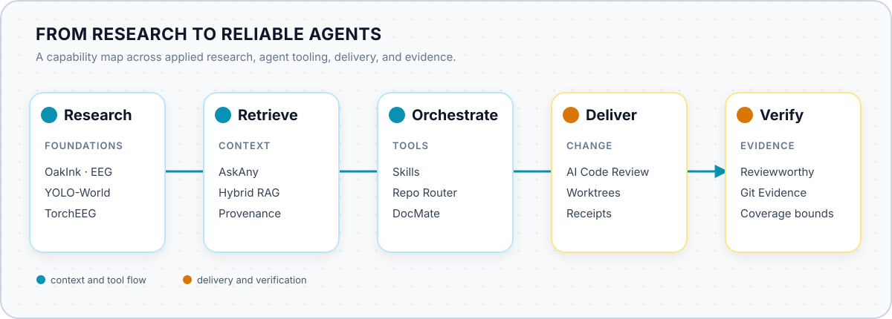
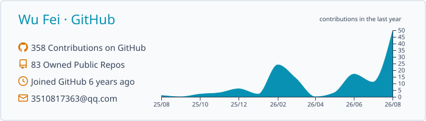

<h1 align="center">Wu Fei</h1>

<strong>Applied AI systems — from research to reliable agents.</strong>

  I build systems that retrieve context, orchestrate tools, and turn engineering claims into verifiable outcomes.

  AI Agents · Developer Tools · Trustworthy Automation · Applied Research

  从应用研究到可靠 Agent 系统，关注上下文、受控执行与可验证结果。

  <a href="mailto:wufeii.sjtu@gmail.com">Email</a> ·
  <a href="#selected-systems">Selected systems</a> ·
  <a href="#selected-research">Research</a>

## From research to reliable agents

<picture>
  <source media="(prefers-color-scheme: dark)" srcset="./assets/system-map-dark.svg">
  <source media="(prefers-color-scheme: light)" srcset="./assets/system-map-light.svg">
  
</picture>

This is a map of shared capabilities and engineering principles, not a claim that every project is part of one runtime system.

## Selected systems

### Knowledge & retrieval

- **[AskAny](https://github.com/wufei-png/AskAny)** — A Chinese-optimized RAG assistant with hybrid retrieval, reranking, tool-call traces, and source provenance.

### Agent workflows & tooling

- **[Skills](https://github.com/wufei-png/skills)** — A catalog of small, composable skills for decision clarification, read-only review, and review-gated delivery.
- **[AgentRepoRouter](https://github.com/wufei-png/AgentRepoRouter)** — Repo-aware routing across repositories, project guidance, and native coding CLI backends.
- **[DocMate](https://github.com/wufei-png/DocMate)** — Documentation QA that cross-checks code, reports gaps, and can prepare isolated documentation repairs.

### Review & delivery

- **[AI-Codereview-Gitlab-Opencode](https://github.com/wufei-png/AI-Codereview-Gitlab-Opencode)** — Multi-provider code review with a durable queue, disposable worktrees, multiple agent backends, and provider-native delivery receipts.

### Evidence & governance

- **[Reviewworthy](https://github.com/wufei-png/reviewworthy)** — Maintainer-first workflows for human-owned AI-assisted contributions, with policy gates and verification evidence.
- **[Git Evidence](https://github.com/wufei-png/git-evidence)** — Provider-neutral engineering activity reports with source-linked claims and explicit coverage boundaries.

## How I build

<picture>
  <source media="(prefers-color-scheme: dark)" srcset="./assets/evidence-trail-dark.svg">
  <source media="(prefers-color-scheme: light)" srcset="./assets/evidence-trail-light.svg">
  
</picture>

- Source-linked evidence over plausible summaries.
- Bounded authority over unconstrained automation.
- Explicit writes over implicit side effects.
- Host-native integration over unnecessary abstraction.
- Human ownership over autonomous contribution volume.

## Selected OSS contributions

- **[YOLO-World](https://github.com/AILab-CVC/YOLO-World)** — Deployment and inference fixes covering operator export, optional text input, batched NMS, and detection counts ([#174](https://github.com/AILab-CVC/YOLO-World/pull/174), [#211](https://github.com/AILab-CVC/YOLO-World/pull/211), [#216](https://github.com/AILab-CVC/YOLO-World/pull/216), [#297](https://github.com/AILab-CVC/YOLO-World/pull/297)).
- **[TorchEEG](https://github.com/torcheeg/torcheeg)** — Tensor-safety and visualization fixes plus FACED dataset support ([#106](https://github.com/torcheeg/torcheeg/pull/106), [#107](https://github.com/torcheeg/torcheeg/pull/107), [#108](https://github.com/torcheeg/torcheeg/pull/108)).
- **[sk2torch](https://github.com/unixpickle/sk2torch)** — Dtype compatibility for support-vector inference ([#2](https://github.com/unixpickle/sk2torch/pull/2)).
- **[gitlab-mcp](https://github.com/zereight/gitlab-mcp)** — GitHub-style toolsets and configurable tool filtering ([#345](https://github.com/zereight/gitlab-mcp/pull/345)).

## Selected research

- **CVPR 2022 · [OakInk: A Large-scale Knowledge Repository for Understanding Hand-Object Interaction](https://arxiv.org/abs/2203.15709)**
- **ICASSP 2024 · [An Attention-Enhanced Retentive Broad Learning System for Subject-Generic Emotion Recognition from EEG Signals](https://doi.org/10.1109/ICASSP48485.2024.10446817)**

My research background spans computer vision and neural signal modeling; my current work explores how those foundations can support reliable agent systems.

## GitHub at a glance

<picture>
  <source media="(prefers-color-scheme: dark)" srcset="./assets/profile-summary-dark.svg">
  <source media="(prefers-color-scheme: light)" srcset="./assets/profile-summary-light.svg">
  
</picture>

Generated weekly from public GitHub data with [GitHub Profile Summary Cards](https://github.com/vn7n24fzkq/github-profile-summary-cards).

## Contact

For research, open-source collaboration, or developer-tooling conversations: **[wufeii.sjtu@gmail.com](mailto:wufeii.sjtu@gmail.com)**.
