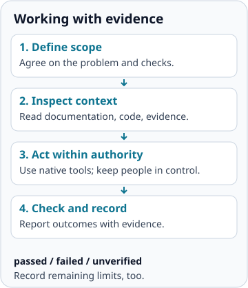

<h1 align="center">Wu Fei</h1>

<strong>Applied AI engineer building agent workflows and developer tools.</strong>

关注让开源工具更容易使用、协作与验证。

  <strong>Start here:</strong>
  <a href="#selected-work">Selected work</a> ·
  <a href="#merged-upstream-contributions">Merged contributions</a> ·
  <a href="mailto:wufeii.sjtu@gmail.com">Email</a>

## Selected work

- **[Skills](https://github.com/wufei-png/skills)** — Installable agent skills for decisions, reviews, staged delivery, and local-session recovery. Browse the catalog to choose a workflow.
- **[DocMate](https://github.com/wufei-png/DocMate)** — Ask questions about project documentation, check gaps against code, and prepare isolated documentation repairs. Repair modes are `ask`, `auto`, and `off`.
- **[AgentRepoRouter](https://github.com/wufei-png/AgentRepoRouter)** — Route coding tasks to the right repository across agent hosts while preserving each coding CLI's native conventions. Start with the installer and repository catalog.
- **[AskAny](https://github.com/wufei-png/AskAny)** — A Chinese-optimized RAG service combining retrieval, agent workflows, and an OpenAI-compatible API. *Status: current runtime has documented limits.* See the [runtime contract](https://github.com/wufei-png/AskAny/blob/main/docs/current-runtime.md) before setup.

## More work

- **[Reviewworthy](https://github.com/wufei-png/reviewworthy)** — Evidence-bounded workflows for AI-assisted external contributions. *Status: early open-source foundation.*
- **[Git Evidence](https://github.com/wufei-png/git-evidence)** — Reproducible activity reports with source-linked claims and explicit coverage boundaries. *Status: implementation / contract hardening; live providers experimental.*
- **[ARC-Bench](https://github.com/wufei-png/arc-bench)** — A generator-agnostic requirement-to-application benchmark with end-to-end Playwright checks. *Status: benchmark and reference tasks.*
- **[review-agent-flow](https://github.com/wufei-png/review-agent-flow)** — GitLab human and AI review orchestration with program-owned publication. *Status: pilot not approved (no-go).* See its current implementation and canary boundaries before trying it.

## Merged upstream contributions

- **[YOLO-World](https://github.com/AILab-CVC/YOLO-World)** — Deployment and inference fixes covering operator export, optional text input, batched NMS, and detection counts ([#174](https://github.com/AILab-CVC/YOLO-World/pull/174), [#211](https://github.com/AILab-CVC/YOLO-World/pull/211), [#216](https://github.com/AILab-CVC/YOLO-World/pull/216), [#297](https://github.com/AILab-CVC/YOLO-World/pull/297)).
- **[TorchEEG](https://github.com/torcheeg/torcheeg)** — Tensor-safety and visualization fixes plus FACED dataset support ([#106](https://github.com/torcheeg/torcheeg/pull/106), [#107](https://github.com/torcheeg/torcheeg/pull/107), [#108](https://github.com/torcheeg/torcheeg/pull/108)).
- **[sk2torch](https://github.com/unixpickle/sk2torch)** — Dtype compatibility for support-vector inference ([#2](https://github.com/unixpickle/sk2torch/pull/2)).
- **[gitlab-mcp](https://github.com/zereight/gitlab-mcp)** — GitHub-style toolsets and configurable tool filtering ([#345](https://github.com/zereight/gitlab-mcp/pull/345)).

## Research background

- **CVPR 2022 · [OakInk: A Large-scale Knowledge Repository for Understanding Hand-Object Interaction](https://arxiv.org/abs/2203.15709)**
- **ICASSP 2024 · [An Attention-Enhanced Retentive Broad Learning System for Subject-Generic Emotion Recognition from EEG Signals](https://doi.org/10.1109/ICASSP48485.2024.10446817)**

My research background spans computer vision and EEG modeling.

## How I build

- **Define scope:** agree on the problem, the intended change, and how to check it.
- **Inspect context:** read relevant documentation, code, and evidence.
- **Act within authority:** use platform-native tools and keep consequential delivery decisions with people.
- **Check and record:** report outcomes as passed, failed, or unverified, with evidence and remaining limits.

<picture>
  <source media="(max-width: 800px) and (prefers-color-scheme: dark)" srcset="./assets/evidence-trail-mobile-dark.svg">
  <source media="(max-width: 800px)" srcset="./assets/evidence-trail-mobile-light.svg">
  <source media="(prefers-color-scheme: dark)" srcset="./assets/evidence-trail-dark.svg">
  
</picture>

## Contact

For open-source collaboration, developer-tooling conversations, or research: **[wufeii.sjtu@gmail.com](mailto:wufeii.sjtu@gmail.com)**.
